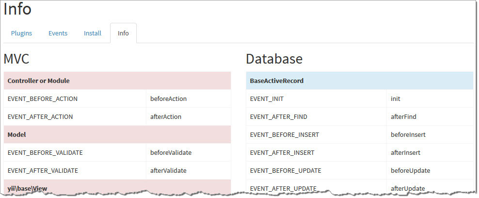

# Create your plugin

To create your plugin you need to run the following required steps

### 1. Create in dir with our plugins `@common\plugins` new folder:
* For example: `test`

### 2. In this folder create:
* `README.md` with usage instruction for this plugin
* New named as folder class `Test`, with information about plugin

```php
<?php

namespace common\plugins\test;

/**
 * Plugin Name: Test plugin
 * Plugin URI:
 * Version: 1.0
 * Description: Small test plugin
 * Author: Andrey Lukyanov
 * Author URI: https://github.com/loveorigami
 */
class Test
{
...
}

```

* Add static property `$appId`

```php

    /**
     * Application id, where plugin will be worked.
     * Support values: frontend, backend, common
     * Default: frontend
     * @var appId string
     */
    public static $appId = 'frontend';

```

* And default configuration

```php
    /**
     * Default configuration for plugin.
     * @var config array()
     */
    public static $config = [
        'term' => 'Hello, world!',
    ];
```

* Then, assign a template events

```php
    public static function events()
    {
        return [
            $eventSenderClassName => [
                $eventName => [$handlerMethodName, self::$config]
            ],
        ];
    }
```

for example:

```php
    public static function events()
    {
        return [
            'yii\base\View' => [
                'afterRender' => ['foo', self::$config]
            ],
        ];
    }
```
more about `$eventSenderClassName` and `$eventName` you can be found on the info tab of this module



* Create a handler method `foo` with the necessary logic

```php
    /**
     * handler method foo
     */
    public function foo($event)
    {
        $term = ($event->data['term']) ? $event->data['term'] : self::$config['term'];

        if (isset($event->output)) {
            $content = $event->output;
            $event->output =  str_replace($term,"<h1>$term</h1>", $content);
        }

        return true;
    }
```

* That's all. Then you have to [install](install_plugin.md) this plugin