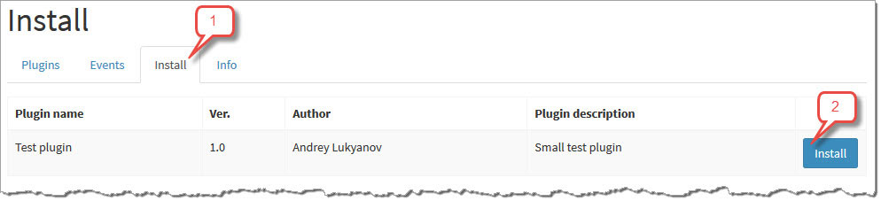
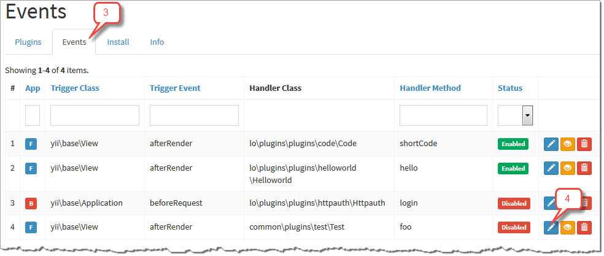
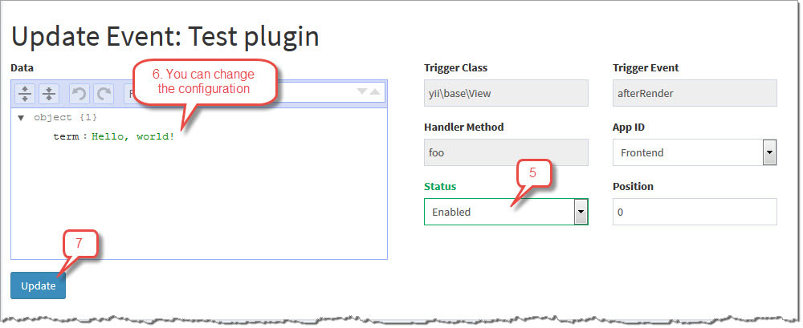
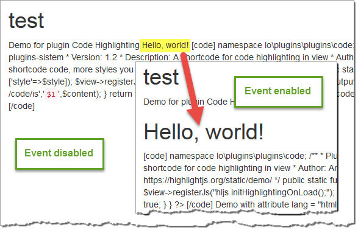

# Install plugin

After [creating](create_plugin.md) your `TestPlugin` first, you must make sure that the our directory plugins included in the module configuration

```php
'modules' => [
    'plugins' => [
        'class' => 'lo\plugins\Module',
        'pluginsDir'=>[
            '@lo/plugins/plugins', // default dir with core plugins
            '@common/plugins', // dir with our plugins
        ]
    ],
],
```

* Then go to the install tab and press button



* Go to the events tab for enabled and configure plugin event



* If you want, change configuration, update...



* Go to the website to see the result

