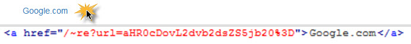

AutoCorrect external links after rendering html page
===================================


## Default Config

```
[
    'noReplaceLocalDomain'              => true,
    'redirectRoute'                      => '/externallinks/redirect',
    'redirectRouteParam'                 => 'url',
    'enabledB64Encode'                  => true,
    'noReplaceLinksOnDomains'           => [
        'site1.ru',
        'www.site1.ru',
        'site2.ru',
    ],
],
```

## How to use

After installation this plugin, open `@frontend/config/main.php` and add following:

```
'controllerMap' => [
    'externallinks' => lo\plugins\core\extralinks\RedirectController::class
],
'components' => [
    'urlManager' => [
        'rules' => [
            //Rewriting the standard route
            //And add robots.txt  Disallow: /~*
            '~re'   => '/externallinks/redirect',
        ]
    ]
]
```
